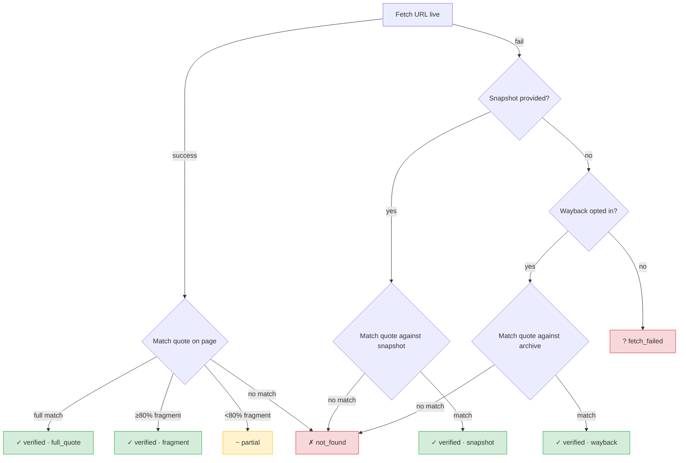

# Design Principles

Proof Engine is an AI agent skill — a set of instructions and bundled Python scripts that plug into LLM coding tools (Claude Desktop, Claude Cowork, Claude Code, Codex CLI, Cursor, Windsurf, Manus, ChatGPT, and others via the [Agent Skills](https://agentskills.io) standard). When a user asks the LLM to verify a factual claim, the skill directs it to produce three artifacts: a re-runnable `proof.py` script, a reader-facing `proof.md` summary, and a `proof_audit.md` with full verification details.

This document describes the design ideas behind it — what problems it solves, what makes the approach unusual, and where it falls short.

## The core idea

LLMs hallucinate facts and make reasoning errors. Instead of making the LLM more accurate, we make it prove its work in a form that doesn't require trusting the LLM at all.

Every proof is a Python script that imports the engine's bundled verification modules. Anyone can re-run it — if the math doesn't hold, the script errors out; if citations can't be fetched or quotes don't match, the proof typically degrades to an explicit "with unverified citations" verdict rather than silently passing. (For table-sourced data, if the prose quote fails but `verify_data_values()` confirms the numbers on the page and cross-checks hold, the proof can still reach full PROVED — the quote failure is a page-structure issue, not an accuracy issue.) The LLM's role is authoring the proof, not asserting the conclusion.

## Non-obvious properties

Most of the interesting design work is in the gaps between the obvious ideas. A few things that might not be apparent from the README:

- **The verification code is not generated at proof time.** The bundled scripts (`verify_citations.py`, `extract_values.py`, etc.) are version-controlled, reviewed, and maintained independently of the proofs they check. The LLM writes the proof; it doesn't write the verifier. That's the trust boundary.
- **Citation failures degrade the verdict, not the proof.** A proof whose URLs return 404 doesn't crash — it typically produces a "with unverified citations" verdict. For table-sourced data, the numbers themselves can be verified on the page even when the prose quote fails, so the verdict can still be full PROVED. The distinction between "wrong," "unverifiable," and "verified by a different method" is tracked explicitly.
- **The skill instructions are structured for LLM consumption.** The main file is ~1,300 words; detailed rules, templates, and checklists are in separate files loaded on-demand at specific workflow steps.
- **The eval harness tests rule compliance, not just correctness.** A proof can produce the right verdict and still violate structural rules. The harness checks both.
- **Source credibility is assessed offline, without affecting the verdict.** Every citation gets a tier (1–5) based on its domain — `.gov` and primary-source institutional sites at the top, unknown domains in the middle, flagged sites at the bottom. This is informational: a verified quote from a tier-2 source still counts, but the audit trail flags it so a reviewer can decide whether to trust it. No API keys, no external calls — just a domain classification list shipped with the scripts.

The rest of this document explains the design choices behind these decisions.

## Two types of facts, two verification strategies

The system recognizes exactly two kinds of facts:

- **Type A (computed)**: The computation is the verification. `sympy.isprime(n)` doesn't need a citation. The code is re-runnable and deterministic.
- **Type B (empirical)**: Every empirical fact needs a source, a URL, and an exact quote. The proof script fetches the URL at runtime and confirms the quote appears on the page. For table-sourced data (where the interesting values are numbers in a table, not prose), `verify_data_values()` confirms each numeric value string appears on the source page — a different check than quote matching, but the same principle: the proof doesn't trust the LLM's transcription.

These are fact types, not claim types. A claim can be purely mathematical, purely empirical, or mixed — combining computation with cited evidence. "Has the US dollar lost more than 90% of its purchasing power since 1913?" is mixed: the CPI values are Type B (cited from BLS data), but the percentage-decline calculation is Type A (computed). The constraint is at the fact level: if an individual fact can't be computed or cited, it doesn't go in the proof.

## Structured verdicts, not confidence scores

The output is one of six verdicts: PROVED, DISPROVED, PARTIALLY VERIFIED, UNDETERMINED, and two "with unverified citations" variants. Not a probability. A "73% confidence" hides *why* 73% — the verdict system forces transparency by making each fact's status visible. The "with unverified citations" variants distinguish "the evidence contradicts the claim" from "the evidence couldn't be reached."

## The 7 hardening rules

These aren't coding guidelines. Each one closes a specific, observed failure mode where proof code looks correct but is silently wrong.

**Rule 1: Never hand-type extracted values.** LLMs read a quote saying "May 14, 1948" and write `date(1948, 5, 15)`. Nothing connects the quote string to the date constructor, so the error is invisible. The fix: parse values from the quote text programmatically. If the parse fails, the proof fails — which is the correct behavior.

**Rule 2: Verify citations by fetching.** LLMs fabricate plausible-sounding citations. They'll generate a `.gov` URL, a credible institution name, and a quote that sounds right. The only defense is fetching the URL and confirming the quote appears on the page. This is harder than it sounds — real web pages use en-dashes where you expect hyphens, curly quotes where you expect straight ones, and HTML tags inside the text. The verification code handles this.

**Rule 3: Anchor to system time.** If a proof needs today's date (e.g., "Israel is over 70 years old"), use `date.today()`. LLMs sometimes get the current date wrong, and a hard-coded date makes the proof non-reproducible after that date passes.

**Rule 4: Explicit claim interpretation.** "More than 90%" — is that strictly greater, or greater-than-or-equal? "Since 1913" — the beginning of 1913, or the end? These ambiguities are common in natural-language claims. The proof must state its interpretation in a `CLAIM_FORMAL` dict before computing anything, so reviewers can disagree with the interpretation even if the math is correct.

**Rule 5: Independent adversarial check.** Confirmation bias is structural, not psychological. If you only search for supporting evidence, you'll find it. The proof must document what counter-evidence was searched for and what was found. This happens during research, not during proof execution — the adversarial section is documentation of work done, not a runtime search.

**Rule 6: Cross-checks must be truly independent.** Two sources parsed from the same variable aren't independent. Two computations that share intermediate values aren't independent. The rule requires that cross-checks come from separate sources parsed separately, so that a single error can't contaminate both sides of a comparison. The validator can only heuristically check this (it counts distinct keys in `empirical_facts`), so the rule is primarily enforced by proof structure and review, not automation.

**Rule 7: Never hard-code constants.** An LLM might write `365.25` for the length of a Gregorian year. The correct value is `365.2425`. The difference is small but matters for long time spans. Constants come from the bundled `computations.py` with sourced values.

A static analyzer (`validate_proof.py`) runs before execution to catch common structural problems — missing `CLAIM_FORMAL`, hardcoded verdicts, probable hand-typed values. It's heuristic, not exhaustive: a fast first pass, not a proof of rule compliance.

## Citation verification is messier than you'd think

Verifying that a quote appears on a web page sounds simple. In practice, the verification code handles Unicode mismatches (en-dashes, curly quotes, non-standard degree symbols), inline HTML tags, pages that return 403 or render via JavaScript, and quotes that partially match due to page updates.

For table-sourced data, `verify_data_values()` runs separately — it confirms each numeric value string appears on the page. If quote verification fails but data values are confirmed and cross-checked, the verdict can still be full PROVED.

Each verification mode (live, snapshot, wayback) is tracked in the audit trail.

An important caveat: citation verification confirms quote *presence*, not semantic *entailment*. A quote can appear on a page and still not mean what the proof claims it means — context might qualify it, or the quote might be cherry-picked. Rule 5 (adversarial checks) partially mitigates this, but the system cannot mechanically verify that a quote supports the conclusion drawn from it. That judgment stays with the human reviewer.

## Asymmetry between proof and disproof

Disproof is almost always easier. To prove "X is true" requires covering all relevant evidence and showing none contradicts it. To disprove "X is true" requires a single verified counterexample.

The system leans into this. For crisp factual claims, a single credible source that contradicts the claim, with a verified quote, is sufficient for DISPROVED. For consensus-style claims ("scientists agree that..."), the system requires multiple independent sources — the default threshold is 3 — because a single source isn't consensus. The threshold is documented in `CLAIM_FORMAL` so reviewers can see and dispute it.

This also means compound claims (X AND Y) often end up PARTIALLY VERIFIED — one sub-claim holds, another doesn't. The system decomposes compound claims and evaluates each part independently.

## What a proof looks like in practice

The `docs/examples/` directory has complete proof triplets. A quick sketch of one — the claim "The US dollar has lost more than 90% of its purchasing power since 1913":

The proof states its interpretation formally (`CLAIM_FORMAL` with operator `>` and threshold `90.0`), defines two independent CPI sources with URLs, prose quotes, and `data_values` dicts containing the actual CPI numbers. It fetches both URLs and verifies the quotes appear on the pages, then separately runs `verify_data_values()` to confirm the numeric values (e.g., `"9.883"`, `"313.689"`) appear in the page text. It computes percentage decline from each source independently, cross-checks the two results (they agree within ~0.005%), documents adversarial checks (alternative indices, hedonic adjustment, date ambiguity), and evaluates the claim via `compare(decline, ">", 90.0)`. Result: PROVED, 6.85 percentage points above the threshold. The entire chain is visible in the script and re-runnable.

## What it can't do

The system works well for claims that decompose into a finite set of extractable facts and a clear rule for what counts as proof or disproof. It struggles with:

- **Causal inference**: "The Roman Empire fell because of lead poisoning" involves competing interpretations of messy evidence. The engine can verify individual facts but can't weigh competing causal theories.
- **Broad literature synthesis**: "Coffee reduces the risk of type 2 diabetes" requires synthesizing dozens of studies with conflicting findings, varying methodologies, and different effect sizes. This is closer to a systematic review than a proof.
- **Competing definitions**: "Is a hot dog a sandwich?" depends on your definition of sandwich. The engine can verify facts about hot dogs and sandwiches, but the conclusion depends on a definitional choice, not evidence.
- **Future predictions**: "AI will surpass human intelligence by 2030" has no verifiable evidence. The engine will decline or return UNDETERMINED.
- **Deep original mathematics**: Beyond what sympy can verify. The engine isn't a theorem prover — it can check that a number is prime or that an equation holds, but it can't prove novel conjectures.

The engine is explicit about these limits. It will decline claims that are opinions, suggest reformulations for ambiguous claims, and return UNDETERMINED rather than guess.

## Reproducibility

Every proof is designed to be re-runnable. Computation proofs are pure Python with no external dependencies beyond standard libraries and sympy. Empirical proofs default to live fetching (with optional Wayback Machine fallback), and can also embed snapshots — pre-fetched page text included in the proof script — for full offline reproducibility. The checked-in examples use live fetch, not snapshots.

The three output files (proof.py, proof.md, proof_audit.md) form a complete record of the proof. When snapshots are embedded, the proof can verify against them without network access. When they aren't, the proof depends on the source URLs remaining available (or archived). The fallback chain — live → snapshot → Wayback — is tracked in the audit trail so you can see how each citation was resolved.

## Separation of concerns

The proof has three output files because it serves three audiences. `proof.py` is for anyone who wants to re-run the verification. `proof.md` is for a reader who wants the verdict, key numbers, and a short explanation. `proof_audit.md` is for a reviewer who wants the citation-by-citation evidence trail and hardening-rule checklist. Combining them into one artifact would force every reader through material meant for someone else.

A similar separation applies to the skill instructions: a short main file with gotchas and a reference index, and detailed rules/templates/checklists in separate files loaded on-demand at specific workflow steps.

## Maintained verification, generated proofs

The verification logic (citation fetching, value extraction, Unicode normalization, static analysis) could theoretically be described in the prompt and generated fresh each time. The problem is that LLMs subtly break verification code: they skip Unicode edge cases, introduce bugs in fragment-matching logic, or simplify the normalization pipeline. The engine avoids this by keeping all verification in version-controlled, reviewed Python scripts that the proof imports. The scripts aren't generated at proof time — that's the trust boundary.

The LLM decides what to prove and how to structure the proof. The bundled scripts do the mechanical work of fetching pages, matching quotes, parsing values, and evaluating comparisons.

A side effect is cross-platform portability. The core of the skill is a markdown file plus Python scripts, but each platform has its own discovery mechanism — Claude Code, Cursor, and Codex CLI install directly from the repo (via plugin manifests or a built-in skill installer), while ChatGPT, Manus, and others consume a flat zip built by CI. The skill definition and verification scripts are identical across all platforms; the packaging layer adapts to each one. See `docs/cross-platform.md` for the full story.

## Testing rule compliance, not just correctness

A proof can produce the right verdict and still be structurally unsound — shared variables between cross-checks (Rule 6), the claim restated as its own "adversarial check" (Rule 5), a hardcoded verdict that happens to be correct. These are the failures that matter most, because they undermine the proof's value as an auditable artifact even when the conclusion is right.

The eval harness tests for this. It runs claims across 9 domains (neuroscience, economics, physics, history, pure math, common myths, VC/startups, Israel-Palestine, global politics) and checks both verdict correctness and rule compliance. The claims are deliberately adversarial — "0.999... repeating is strictly less than 1" (it isn't), "The integer 1 is a prime number" (it isn't), "The Goldbach conjecture holds for every even integer" (unproven — the engine should return UNDETERMINED, not attempt a proof).

## Design choices that might seem wrong

**Why not use an LLM to verify citations?** The whole point is removing LLM trust from the verification chain. If an LLM writes the quote and an LLM verifies it, you've added a step without adding reliability. The verification is mechanical: fetch, normalize, match.

**Why six verdicts instead of two?** The space between "true" and "false" is where most real claims live. A claim might be true in its core assertion but false in a qualifying detail. Collapsing these into true/false loses information that matters.

**Why the web instead of a knowledge graph?** Knowledge graphs are limited to what someone has already structured. The web is messier but more comprehensive and current.
