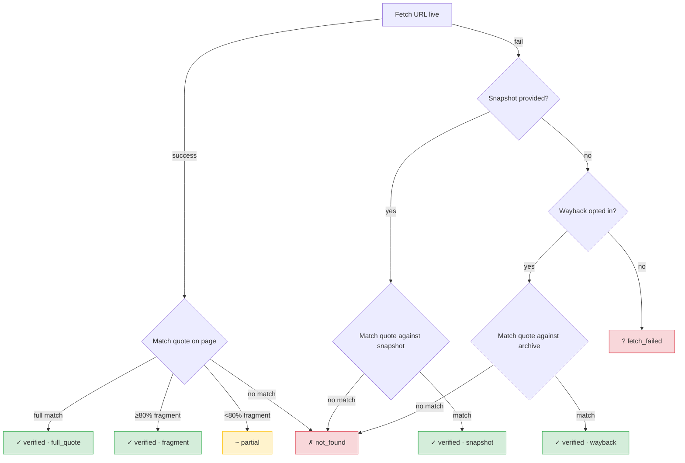

# Design Principles

Proof Engine is an AI agent skill — a set of instructions and bundled Python scripts that plug into LLM coding tools (Claude Desktop, Claude Cowork, Claude Code, Codex CLI, Cursor, Windsurf, Manus, ChatGPT, and others via the [Agent Skills](https://agentskills.io) standard). When a user asks the LLM to verify a factual claim, the skill directs it to produce four artifacts: a re-runnable `proof.py` script, a structured `proof.md` proof report, a `proof_audit.md` with full verification details, and a `proof_narrative.md` reader-facing narrative summary.

This document describes the design ideas behind it — what problems it solves, what makes the approach unusual, and where it falls short.

## The core idea

LLMs hallucinate facts and make reasoning errors. Instead of making the LLM more accurate, we make it prove its work in a form that doesn't require trusting the LLM at all.

Every proof is a Python script that imports the engine's bundled verification modules. Anyone can re-run it — if the math doesn't hold, the script errors out; if citations can't be fetched or quotes don't match, the proof typically degrades to an explicit "with unverified citations" verdict rather than silently passing. (For table-sourced data, if the prose quote fails but `verify_data_values()` confirms the numbers on the page and cross-checks hold, the proof can still reach full PROVED — the quote failure is a page-structure issue, not an accuracy issue.) The LLM's role is authoring the proof, not asserting the conclusion.

## Non-obvious properties

Most of the interesting design work is in the gaps between the obvious ideas. A few things that might not be apparent from the README:

- **The verification code is not generated at proof time.** The bundled scripts (`verify_citations.py`, `extract_values.py`, etc.) are version-controlled, reviewed, and maintained independently of the proofs they check. The LLM writes the proof; it doesn't write the verifier. That's the trust boundary.
- **Citation failures degrade the verdict, not the proof.** A proof whose URLs return 404 doesn't crash — it typically produces a "with unverified citations" verdict. For table-sourced data, the numbers themselves can be verified on the page even when the prose quote fails, so the verdict can still be full PROVED. The distinction between "wrong," "unverifiable," and "verified by a different method" is tracked explicitly.
- **The skill instructions are structured for LLM consumption.** The main file is ~1,300 words; detailed rules, templates, and checklists are in separate files loaded on-demand at specific workflow steps.
- **The eval harness tests rule compliance, not just correctness.** A proof can produce the right verdict and still violate structural rules. The harness checks both.
- **Source credibility is assessed offline, without affecting the verdict.** Every citation gets a tier (1–5) based on its domain — `.gov` and primary-source institutional sites at the top, unknown domains in the middle, flagged sites at the bottom. This is informational: a verified quote from a tier-2 source still counts, but the audit trail flags it so a reviewer can decide whether to trust it. No API keys, no external calls — just a domain classification list shipped with the scripts.

The rest of this document explains the design choices behind these decisions.

## Three types of facts, three verification strategies

The system recognizes exactly three kinds of facts:

- **Type A (computed)**: The computation is the verification. `sympy.isprime(n)` doesn't need a citation. The code is re-runnable and deterministic.
- **Type B (empirical)**: Every empirical fact needs a source, a URL, and an exact quote. The proof script fetches the URL at runtime and confirms the quote appears on the page. For table-sourced data (where the interesting values are numbers in a table, not prose), `verify_data_values()` confirms each numeric value string appears on the source page — a different check than quote matching, but the same principle: the proof doesn't trust the LLM's transcription.
- **Type S (search)**: For absence-of-evidence proofs, each database search is documented with a clickable `search_url`. The tool confirms the URL is accessible but cannot verify the result count — that's author-reported and reproducible by a human reviewer. This weaker trust boundary is reflected in the `SUPPORTED` verdict (never `PROVED`).

These are fact types, not claim types. A claim can be purely mathematical, purely empirical, or mixed — combining computation with cited evidence. "Has the US dollar lost more than 90% of its purchasing power since 1913?" is mixed: the CPI values are Type B (cited from BLS data), but the percentage-decline calculation is Type A (computed). The constraint is at the fact level: if an individual fact can't be computed or cited, it doesn't go in the proof.

## Structured verdicts, not confidence scores

The output is one of eight verdicts: PROVED, DISPROVED, SUPPORTED, PARTIALLY VERIFIED, UNDETERMINED, and three "with unverified citations" variants. Not a probability. A "73% confidence" hides *why* 73% — the verdict system forces transparency by making each fact's status visible. The "with unverified citations" variants distinguish "the evidence contradicts the claim" from "the evidence couldn't be reached."

## The 7 hardening rules

These aren't coding guidelines. Each one closes a specific, observed failure mode where proof code looks correct but is silently wrong.

**Rule 1: Never hand-type extracted values.** LLMs read a quote saying "May 14, 1948" and write `date(1948, 5, 15)`. Nothing connects the quote string to the date constructor, so the error is invisible. The fix: parse values from the quote text programmatically. If the parse fails, the proof fails — which is the correct behavior.

**Rule 2: Verify citations by fetching.** LLMs fabricate plausible-sounding citations. They'll generate a `.gov` URL, a credible institution name, and a quote that sounds right. The only defense is fetching the URL and confirming the quote appears on the page. This is harder than it sounds — real web pages use en-dashes where you expect hyphens, curly quotes where you expect straight ones, and HTML tags inside the text. The verification code handles this.

**Rule 3: Anchor to system time.** If a proof needs today's date (e.g., "Israel is over 70 years old"), use `date.today()`. LLMs sometimes get the current date wrong, and a hard-coded date makes the proof non-reproducible after that date passes.

**Rule 4: Explicit claim interpretation.** "More than 90%" — is that strictly greater, or greater-than-or-equal? "Since 1913" — the beginning of 1913, or the end? These ambiguities are common in natural-language claims. The proof must state its interpretation in a `CLAIM_FORMAL` dict before computing anything, so reviewers can disagree with the interpretation even if the math is correct.

**Rule 5: Independent adversarial check.** Confirmation bias is structural, not psychological. If you only search for supporting evidence, you'll find it. The proof must document what counter-evidence was searched for and what was found. This happens during research, not during proof execution — the adversarial section is documentation of work done, not a runtime search.

**Rule 6: Cross-checks must be truly independent.** Two sources parsed from the same variable aren't independent. Two computations that share intermediate values aren't independent. The rule requires that cross-checks come from separate sources parsed separately, so that a single error can't contaminate both sides of a comparison. The validator can only heuristically check this (it counts distinct keys in `empirical_facts`), so the rule is primarily enforced by proof structure and review, not automation.

**Rule 7: Never hard-code constants.** An LLM might write `365.25` for the length of a Gregorian year. The correct value is `365.2425`. The difference is small but matters for long time spans. Constants come from the bundled `computations.py` with sourced values.

A static analyzer (`validate_proof.py`) runs before execution to catch common structural problems — missing `CLAIM_FORMAL`, hardcoded verdicts, probable hand-typed values. It's heuristic, not exhaustive: a fast first pass, not a proof of rule compliance.

## Prose Reference Verification

Every external scholarly reference in a proof — whether in `meta.yaml` `depends_on`, in v3 `evidence[*].source.url`, or in free prose inside any `.md` file — is resolved to canonical metadata from an authoritative registry (PubMed E-utilities, Crossref, DataCite, arXiv, Software Heritage, Handle.Net, OpenLibrary) and cached per-proof in `depends_on_resolved.json`. As of v1.37.0 the resolution backends live in the pip-installable `proof_citations.resolvers` package; `tools/lib/proof_cache.py` (renamed from `tools/lib/reference_resolver.py` in v1.38.0) consumes the package and persists the legacy cache shape.

Prose attributions are cross-checked against the resolved metadata by four passes:

1. **Pass 1** finds identifiers in literal prose and inside Markdown link targets.
2. **Pass 2** cross-checks every prose attribution within a 160-char window of each identifier (and every link-display-text for short-form link citations) against the resolved author list and title.
3. **Pass 3** advises (warns) when a declared identifier is never mentioned in prose.
4. **Pass 4** sweeps the whole file for dangling `Author, "Title"` and `Author (YYYY)` shapes that are not covered by any verification window, closing the launder-attack class where a correct linked citation elsewhere in the file would otherwise launder a hand-typed misattribution.

Authors use `{{cite:<type>:<value>[:<style>]}}` tokens in draft prose and run `proof-site.py cite-expand` to materialize them into canonical Markdown citations — committed to git, served by the HTML build, and archived verbatim to Zenodo on `mint-doi`. Both `publish` and `mint-doi` run a strictly-offline pre-flight gate (`cite-expand --check` + `verify-prose`) so a wrong attribution or unexpanded token cannot reach the archived artifact.

## Source independence and conflicts of interest

Rule 6 requires independent cross-checks, but "independent" isn't binary. A news article and an advocacy report might both cite the same government intelligence dossier — technically different outlets, but not independent primary sources. And a source with a direct stake in the claim's outcome may confirm it for reasons other than truth.

The system addresses this with two mechanisms:

**COI taxonomy.** Each source in a proof's cross-checks can carry conflict-of-interest flags from six categories: financial, institutional, ideological, geographic, personal, and litigation. Each flag records the source key, COI category, direction (favorable or unfavorable to the claim's subject), and severity (direct or indirect). These are documented in the audit trail so reviewers can see which sources have potential biases.

**Mechanical verdict override.** If more than half of a sub-claim's confirmed sources have COI flags pointing in the same direction, the verdict is forced to UNDETERMINED regardless of the count. This prevents a proof from reaching PROVED (or DISPROVED) when the confirming evidence is dominated by interested parties. The threshold is deliberately aggressive — a single clean source among several biased ones is enough to prevent the override.

One exception: provenance sub-claims (SC1 in the contested qualifier pattern) bypass the COI gate entirely. A biased source can still reliably confirm that an allegation *was made* — COI doesn't undermine provenance, only epistemic claims about truth or verification.

## Citation verification is messier than you'd think

Verifying that a quote appears on a web page sounds simple. In practice, the verification code handles Unicode mismatches (en-dashes, curly quotes, non-standard degree symbols), inline HTML tags, pages that return 403 or render via JavaScript, and quotes that partially match due to page updates.

```mermaid
flowchart TD
    A[Fetch URL live] -->|success| B{Match quote on page}
    A -->|fail| C{Snapshot provided?}

    B -->|full match| V1[✓ verified · full_quote]
    B -->|≥80% fragment| V2[✓ verified · fragment]
    B -->|<80% fragment| V3[~ partial]
    B -->|no match| V4[✗ not_found]

    C -->|yes| D{Match quote against snapshot}
    C -->|no| E{Wayback opted in?}

    D -->|match| V5[✓ verified · snapshot]
    D -->|no match| V4

    E -->|yes| F{Match quote against archive}
    E -->|no| V6[? fetch_failed]

    F -->|match| V7[✓ verified · wayback]
    F -->|no match| V4

    style V1 fill:#d4edda,stroke:#28a745
    style V2 fill:#d4edda,stroke:#28a745
    style V5 fill:#d4edda,stroke:#28a745
    style V7 fill:#d4edda,stroke:#28a745
    style V3 fill:#fff3cd,stroke:#ffc107
    style V4 fill:#f8d7da,stroke:#dc3545
    style V6 fill:#f8d7da,stroke:#dc3545
```

For table-sourced data, `verify_data_values()` runs separately — it confirms each numeric value string appears on the page. If quote verification fails but data values are confirmed and cross-checked, the verdict can still be full PROVED.

Each verification mode (live, snapshot, wayback) is tracked in the audit trail.

An important caveat: citation verification confirms quote *presence*, not semantic *entailment*. A quote can appear on a page and still not mean what the proof claims it means — context might qualify it, or the quote might be cherry-picked. Rule 5 (adversarial checks) partially mitigates this, but the system cannot mechanically verify that a quote supports the conclusion drawn from it. That judgment stays with the human reviewer.

## Asymmetry between proof and disproof

Disproof is almost always easier. To prove "X is true" requires covering all relevant evidence and showing none contradicts it. To disprove "X is true" requires a single verified counterexample.

The system leans into this. For crisp factual claims, a single credible source that contradicts the claim, with a verified quote, is sufficient for DISPROVED. For consensus-style claims ("scientists agree that..."), the system requires multiple independent sources — the default threshold is 3 — because a single source isn't consensus. The threshold is documented in `CLAIM_FORMAL` so reviewers can see and dispute it.

This also means compound claims (X AND Y) often end up PARTIALLY VERIFIED — one sub-claim holds, another doesn't. The system decomposes compound claims and evaluates each part independently.

### Contested qualifiers

A special case arises when a claim bundles a factual assertion with an epistemic qualifier: "X was *verified*," "Y was *confirmed*," "Z was *proven*." These need two different kinds of evidence — did someone make the assertion (provenance), and has anyone independently confirmed it (epistemic warrant)?

The compound template handles this via SC1/SC2 decomposition. SC1 checks provenance: did an identifiable source make the underlying claim? SC2 checks the qualifier: has any independent body confirmed it? Both must hold for PROVED. If SC1 holds but SC2 fails, the verdict is DISPROVED — the assertion exists, but the qualifier is false.

This matters because a naive decomposition would produce PARTIALLY VERIFIED (one sub-claim holds, one doesn't). But for contested qualifiers, "the assertion was made but not verified" is a clean disproof of the *qualified* claim, not a partial verification. The system auto-detects contested qualifier claims from the `operator_note` and routes them to the DISPROVED branch.

An expected consequence: SC2 often has zero empirical facts. When no independent body has confirmed a qualifier, there are simply no confirming sources to cite. Sources that *reject* the qualifier (an independent review finding "claims not substantiated") go in adversarial checks as counter-evidence, not in SC2's fact list — they support the disproof, but they aren't confirming sources for the qualifier.

## What a proof looks like in practice

The `docs/examples/` directory has complete proofs. Here's an annotated walkthrough of one — the claim "The purchasing power of the US dollar has declined by more than 90% since the Federal Reserve was established in 1913" — showing what happens at each stage and why.

**Step 1: Formalize the claim.** The proof states exactly what it's testing in a `CLAIM_FORMAL` dict: "more than 90%" means strictly greater than 90.0% (operator `>`), purchasing power is operationalized via CPI-U, and "established in 1913" refers to the Federal Reserve Act signed December 23, 1913 with the CPI baseline using the 1913 annual average. The interpretation is documented with an `operator_note` explaining each choice. A reviewer can disagree with the interpretation even if the math is correct — that's the point.

**Step 2: Fetch and verify sources.** The proof cites two independent CPI sources (BLS data via rateinflation.com and inflationdata.com), each with a URL, a prose quote, and a `data_values` dict containing the actual CPI numbers. At runtime, the script fetches each URL and searches for the prose quote on the live page after normalizing Unicode and stripping HTML tags. A full match yields `verified`; a partial match (≥80% fragment) still passes but is flagged; no match yields `not_found`. If the LLM fabricated a quote, the check catches it — and if the match is only partial, the verdict downgrades to "with unverified citations" so the gap is visible. The two sources are independent (different websites republishing the same upstream BLS data) so a transcription error on one site doesn't contaminate the other.

**Step 3: Verify data values, then extract.** The CPI numbers live in `data_values` dicts alongside each source — string literals like `"9.883"` and `"313.689"` that the LLM transcribed from the source page. This is a checked transcription: `verify_data_values()` fetches the source page and confirms each value string actually appears in the page text. If the LLM transcribed a number wrong, it won't be found on the page and the check fails. Once verified, the numbers are parsed from those `data_values` strings into floats using `parse_number_from_quote()`. The trust model is: the LLM writes the values, but the verifier confirms they appear on the source page before the proof computes with them.

**Step 4: Compute the answer.** Decline = (1 − CPI_1913 / CPI_2024) × 100. Using Source A: (1 − 9.883 / 313.689) × 100 = 96.85%. This is Python arithmetic via `explain_calc()`, which uses AST introspection to print the symbolic expression, substituted values, and result in one line — so the computation describes itself. The engine uses `compare(decline, ">", 90.0)` from the bundled `computations.py` instead of letting the LLM write the comparison or use `eval()`.

**Step 5: Cross-check.** The same computation runs independently on Source B (CPI 1913 = 9.9, CPI 2024 = 313.689). The two decline percentages must agree within tolerance. They do — the difference is ~0.005%, attributable to Source B rounding the 1913 CPI to one decimal place. This cross-check uses independently parsed values from separate sources, so a single error can't pass both sides.

**Step 6: Adversarial check.** Before concluding, the proof documents searches for counter-evidence: Does hedonic quality adjustment mean CPI overstates inflation enough to drop below 90%? Was the Fed established in 1913 (Act signed) or 1914 (Reserve Banks opened) — does the date choice matter? Could a different price index (PCE, GDP deflator) yield a decline below 90%? Each search is documented with what was found and whether it breaks the proof. None do — the margin is too large.

**Step 7: Verdict.** PROVED — the decline is 96.85%, which is 6.85 percentage points above the 90% threshold. Both sources agree. The full audit trail shows every citation fetch, every data value verification, every extraction, every cross-check.

The entire chain is in `proof.py`. Run it yourself: `python proof.py`. Every number traces back to a live source through code you can inspect and re-execute.

## What it can't do

The system works well for claims that decompose into a finite set of extractable facts and a clear rule for what counts as proof or disproof. It struggles with:

- **Causal inference**: "The Roman Empire fell because of lead poisoning" involves competing interpretations of messy evidence. The engine can verify individual facts but can't weigh competing causal theories.
- **Broad literature synthesis**: "Coffee reduces the risk of type 2 diabetes" requires synthesizing dozens of studies with conflicting findings, varying methodologies, and different effect sizes. This is closer to a systematic review than a proof.
- **Competing definitions**: "Is a hot dog a sandwich?" depends on your definition of sandwich. The engine can verify facts about hot dogs and sandwiches, but the conclusion depends on a definitional choice, not evidence.
- **Future predictions**: "AI will surpass human intelligence by 2030" has no verifiable evidence. The engine will decline or return UNDETERMINED.
- **Deep original mathematics**: Beyond what sympy can verify. The engine isn't a theorem prover — it can check that a number is prime or that an equation holds, but it can't prove novel conjectures.

The engine is explicit about these limits. It will decline claims that are opinions, suggest reformulations for ambiguous claims, and return UNDETERMINED rather than guess.

## Reproducibility

Every proof is designed to be re-runnable. Computation proofs are pure Python with no external dependencies beyond standard libraries and sympy. Empirical proofs default to live fetching (with optional Wayback Machine fallback), and can also embed snapshots — pre-fetched page text included in the proof script — for full offline reproducibility. The checked-in examples use live fetch, not snapshots.

The four output files (proof.py, proof.md, proof_audit.md, proof_narrative.md) form a complete record of the proof. When snapshots are embedded, the proof can verify against them without network access. When they aren't, the proof depends on the source URLs remaining available (or archived). The fallback chain — live → snapshot → Wayback — is tracked in the audit trail so you can see how each citation was resolved.

For machine consumption, each published proof also includes three additional formats generated at build time: a **Jupyter Notebook** (`proof.ipynb`) for interactive re-verification in any notebook environment, a **W3C PROV-JSON** document (`provenance.json`) encoding the full provenance chain in the W3C Provenance standard, and an **RO-Crate 1.1** metadata file (`ro-crate-metadata.json`) packaging all proof artifacts as a self-describing research object for archival and interoperability. These are derived from the four core files — they don't add new information, but they make the same information accessible to notebook environments, provenance-aware pipelines, and research data management systems.

### Interactive re-verification

Every published proof page links to a one-click Binder launcher. The launcher repo [`yaniv-golan/proof-engine-binder`](https://github.com/yaniv-golan/proof-engine-binder) pins the Python runtime, installs the dependencies `proof.py` scripts use, and clones the main `proof-engine` repo at the matching minor-release tag. A Jupyter Server extension in the launcher image intercepts every incoming request and captures one of two URL shapes that the proof page emits, writing the parsed identifier to a sentinel file under `/tmp/`. The launcher notebook reads the sentinel on cell execution, fetches `proof.py`, and executes it with `PROOF_ENGINE_ROOT` set to the cloned skill path.

The two URL shapes correspond to two trust anchors:

- **Minted proofs** (`?doi=<Zenodo DOI>`) — the DOI resolves via Zenodo's REST API to immutable bytes deposited at mint time. A proof verified this way resolves to the same `proof.py` a year from now.
- **Unminted proofs** (`?slug=<slug>&ref=<40-hex-sha>`) — the launcher fetches `https://raw.githubusercontent.com/yaniv-golan/proof-engine/<sha>/site/proofs/<slug>/proof.py`. The trust anchor is the commit SHA in the URL: the executed bytes are the same bytes the "View proof source" section on the page rendered at that commit. The site build embeds the deploying commit SHA into every unminted proof's Binder URL, so the page text and the executable code can never diverge.

The capture mechanism is necessary because Binder's redirect chain preserves the query string on the first request that reaches the user's Jupyter server, but JupyterLab's SPA router strips it from `window.location.search` before any client-side JavaScript runs.

Five properties of this design worth noting:
1. **Immutable launcher reference.** `binder_url` values in `doi.json` and rendered HTML both point at a specific launcher git tag (e.g. `v1.22.0`) — never a moving branch. The launcher tag is derived from the main repo's `VERSION` (`vMAJOR.MINOR.0`), so `bump-version.sh` propagates it automatically.
2. **Two trust anchors, one mechanism.** DOI mode is anchored on Zenodo; slug mode is anchored on a git commit SHA. Both are immutable. The launcher cell handling these is a single branch on `MODE`; nothing else differs between the paths.
3. **Zero Zenodo mutations per launcher change.** The launcher URL lives in this repo (in `doi.json` files for minted proofs, computed at build time for unminted), not in Zenodo metadata. Rotating a compromised tag or patching an infrastructure break is a repo commit, not a Zenodo republication.
4. **One Binder cold build per launcher release.** Each immutable launcher tag has its own Binder image cache; image reuse is keyed by git ref.
5. **Forward-portable proof.py.** Generated proofs read `PROOF_ENGINE_ROOT` from an env var with a hardcoded fallback. Local runs use the fallback; the launcher sets the env var. One file shape serves both environments.

## Separation of concerns

The proof has four output files because it serves four audiences. `proof.py` is for anyone who wants to re-run the verification. `proof.md` is the structured proof report with verdict and key numbers. `proof_audit.md` is for a reviewer who wants the citation-by-citation evidence trail and hardening-rule checklist. `proof_narrative.md` is a plain-language narrative summary for general readers. Combining them into one artifact would force every reader through material meant for someone else.

The site build pipeline adds three machine-readable formats on top of these four: a Jupyter Notebook for interactive re-verification, a W3C PROV-JSON provenance trace for automated pipelines, and an RO-Crate 1.1 research object package for archival. These are generated, not authored — the source of truth remains the four committed files. The separation means the core proof artifacts stay portable (they work without the site), while the machine-readable formats add interoperability for systems that consume structured metadata.

A similar separation applies to the skill instructions: a short main file with gotchas and a reference index, and detailed rules/templates/checklists in separate files loaded on-demand at specific workflow steps.

## Maintained verification, generated proofs

The verification logic (citation fetching, value extraction, Unicode normalization, static analysis) could theoretically be described in the prompt and generated fresh each time. The problem is that LLMs subtly break verification code: they skip Unicode edge cases, introduce bugs in fragment-matching logic, or simplify the normalization pipeline. The engine avoids this by keeping all verification in version-controlled, reviewed Python scripts that the proof imports. The scripts aren't generated at proof time — that's the trust boundary.

The LLM decides what to prove and how to structure the proof. The bundled scripts do the mechanical work of fetching pages, matching quotes, parsing values, and evaluating comparisons.

A side effect is cross-platform portability. The core of the skill is a markdown file plus Python scripts, but each platform has its own discovery mechanism — Claude Code, Cursor, and Codex CLI install directly from the repo (via plugin manifests or a built-in skill installer), while ChatGPT, Manus, and others consume a flat zip built by CI. The skill definition and verification scripts are identical across all platforms; the packaging layer adapts to each one. See `docs/cross-platform.md` for the full story.

## Testing rule compliance, not just correctness

A proof can produce the right verdict and still be structurally unsound — shared variables between cross-checks (Rule 6), the claim restated as its own "adversarial check" (Rule 5), a hardcoded verdict that happens to be correct. These are the failures that matter most, because they undermine the proof's value as an auditable artifact even when the conclusion is right.

The eval harness tests for this. It runs claims across 9 domains (neuroscience, economics, physics, history, pure math, common myths, VC/startups, Israel-Palestine, global politics) and checks both verdict correctness and rule compliance. The claims are deliberately adversarial — "0.999... repeating is strictly less than 1" (it isn't), "The integer 1 is a prime number" (it isn't), "The Goldbach conjecture holds for every even integer" (unproven — the engine should return UNDETERMINED, not attempt a proof).

## Citation and DOI architecture

Proofs are citable artifacts. Each proof page includes BibTeX, RIS, APA, and Chicago citation exports, generated at build time from a single source of truth (`tools/lib/citation.py`). The template renders pre-formatted strings — no duplicate formatting logic.

DOI state lives in a `doi.json` sidecar file in each proof's source directory, not in `proof.json` (which is a generated artifact that gets overwritten on regeneration). The sidecar stores the version-specific DOI, concept DOI (all versions), Zenodo record IDs, and the original `claim_natural` text. On force-publish, the publish pipeline compares the sidecar's `claim_natural` against the incoming proof's — if they differ, publish aborts. This prevents silently attaching an old DOI to a new proof after a slug is reused.

Citations use the version-specific DOI for reproducibility. The concept DOI (which resolves to the latest version) is surfaced as an additional "all versions" link in the UI and JSON-LD `sameAs` array.

At build time, `build-site.py` reads `doi.json` (if present), generates citation export files (`cite.bib`, `cite.ris`, `cite.txt`), injects a `citation` block into the built `proof.json`, adds `doi` to entries in both the legacy catalog (`/catalog.json`, formerly `/index.json` before v1.28.0) and the Proof Registry index (`/index.json`, per `docs/registry-protocol.md`), and enriches the JSON-LD `ClaimReview` with `identifier` and `sameAs` fields.

When a proof is minted via `mint-doi`, its full `meta.yaml depends_on` graph is propagated into the Zenodo record's DataCite `related_identifiers` — every originating paper, upstream proof DOI, Software Heritage archive, and external URL, each with the correct DataCite `relation` (`isDerivedFrom`, `references`, …). A `resource_type` is attached only where the identifier scheme maps unambiguously (arXiv → preprint, SWHID → software, ISBN → book); DOIs intentionally omit it so Zenodo/DataCite resolves the target's own type. Slug-only entries (upstream not yet minted) are skipped with a stderr warning; re-run with `--force` after minting upstream to pick them up.

## Proof freshness and the regeneration pipeline

Published proofs go stale. A URL that resolved in 2024 may 404 in 2026. A quote may be edited, moved, or removed. A government dataset may be revised. A statistic may have a newer value that changes the verdict. The proof as an artifact is reproducible — but reproducibility only means "you get the same answer from the same sources"; it doesn't mean the sources are still correct.

The regeneration pipeline is the mechanism for keeping the proof catalog current. A queue file (`tools/regen-queue.yaml`) tracks all published proofs with their regeneration status. A GitHub Actions workflow (`daily-regen.yml`) picks one proof at a time, reruns it through the proof agent, compares the result to the original, and opens a pull request. A human reviewer sees the full diff — old verdict vs. new verdict, old claim vs. new, artifact sizes, agent run stats — and decides whether to merge. The workflow is designed as a slow background process: one proof per run, every proof refreshed over time.

The key gate before a PR is opened is claim identity. A regenerated proof must have the same `claim_natural` text as the original (whitespace-normalized). If the claim changed — the LLM drifted the wording, the topic shifted, anything — the run is rejected before a PR opens. This prevents a regen cycle from silently replacing a proof's question with a different one.

Verdict changes don't block the PR, but they're flagged prominently. If a proof was PROVED and regenerates as SUPPORTED, the reviewer sees `⚠️ changed` in the PR body alongside the old and new verdicts. The review checklist explicitly includes "verdict matches the evidence presented" as a step, so a changed verdict triggers closer scrutiny rather than automatic approval or rejection.

### Programmatic invocation and model selection

Proof generation was originally a one-shot human-facing workflow: a shell script that called the skill interactively and printed a command to publish. The regeneration pipeline needed something different — a process that could be invoked programmatically, returned structured output, and could run with different models depending on context and cost.

`tools/proof_agent.py` is that interface. It takes a slug, a claim, an output directory, the skill directory, a primary model, and an optional fallback model. It runs the full agent loop — calling the LLM, dispatching tool calls, enforcing the termination gate — and returns a structured `AgentResult` with status, iteration count, model used, timing, and any `proof.json` keys the LLM wrote that the schema didn't recognize. It also writes a full transcript of the agent session.

Model selection goes through [OpenRouter](https://openrouter.ai/), which exposes a unified API for a large number of models. The `--model` and `--fallback-model` flags accept any OpenRouter model identifier. The fallback fires automatically when the primary model returns a quota or rate-limit error mid-run, so a long agent loop can switch models without starting over. The default workflow configuration uses cost-efficient models for queue automation, but any model — `anthropic/claude-opus-4-7`, `openai/gpt-4o`, `google/gemini-2.5-pro` — works with the same command.

The agent enforces a per-run call cap (`max_llm_calls`, default 150) that counts every HTTP attempt including retries, not just successful calls. This prevents a malfunctioning loop from draining quota. A separate `max_iterations` cap (default 80) bounds tool-use cycles at the application level. Both are configurable at the call site.

**Why not use an LLM to verify citations?** The whole point is removing LLM trust from the verification chain. If an LLM writes the quote and an LLM verifies it, you've added a step without adding reliability. The verification is mechanical: fetch, normalize, match.

**Why eight verdicts instead of two?** The space between "true" and "false" is where most real claims live. A claim might be true in its core assertion but false in a qualifying detail. Collapsing these into true/false loses information that matters.

**Why the web instead of a knowledge graph?** Knowledge graphs are limited to what someone has already structured. The web is messier but more comprehensive and current.
